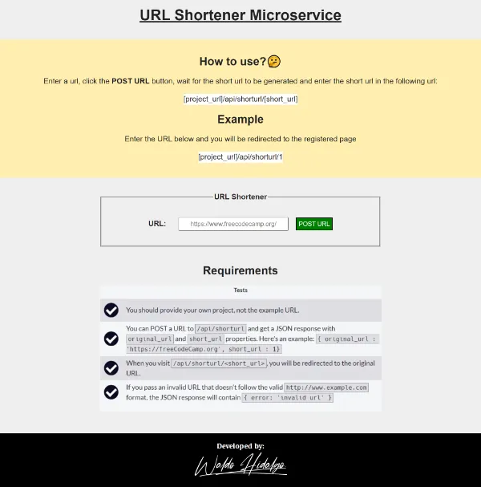
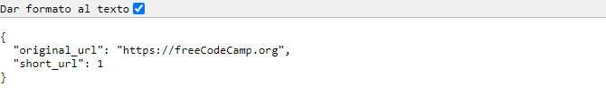

# URL Shortener Microservice by Waldo

Tercer proyecto [URL Shortener Microservice](https://www.freecodecamp.org/learn/back-end-development-and-apis/back-end-development-and-apis-projects/url-shortener-microservice) el cual corresponde a un proyecto requisito obligatorio para obtener la **Back End Development and APIs Certification** de [freecodecamp](https://www.freecodecamp.org/learn/back-end-development-and-apis/#back-end-development-and-apis-projects).

## Tabla de Contenido

- [URL Shortener Microservice by Waldo](#url-shortener-microservice-by-waldo)
  - [Tabla de Contenido](#tabla-de-contenido)
  - [Requerimientos](#requerimientos)
  - [Screenshots](#screenshots)
    - [1. Home Page](#1-home-page)
    - [2. Respuesta del servidor al hacer post a /api/shorturl con una URL válida](#2-respuesta-del-servidor-al-hacer-post-a-apishorturl-con-una-url-válida)
    - [3.Respuesta del servidor al hacer post a /api/shorturl con una URL inválida](#3respuesta-del-servidor-al-hacer-post-a-apishorturl-con-una-url-inválida)
    - [4. Respuesta del servidor al hacer get a la ruta /api/shorturl/:shortUrl donde shortUrl no existe en la base de datos](#4-respuesta-del-servidor-al-hacer-get-a-la-ruta-apishorturlshorturl-donde-shorturl-no-existe-en-la-base-de-datos)

## Requerimientos

## Screenshots

### 1. Home Page

### 2. Respuesta del servidor al hacer post a /api/shorturl con una URL válida

### 3.Respuesta del servidor al hacer post a /api/shorturl con una URL inválida

### 4. Respuesta del servidor al hacer get a la ruta /api/shorturl/:shortUrl donde shortUrl no existe en la base de datos

